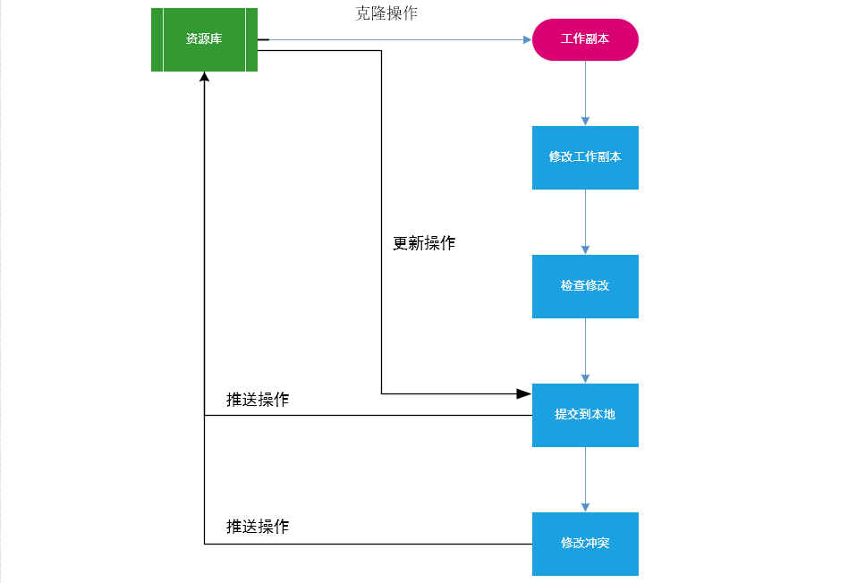
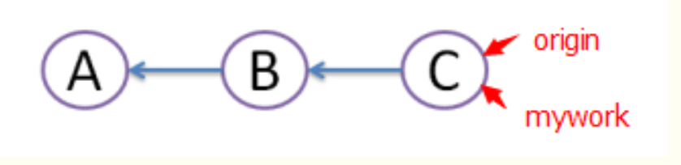
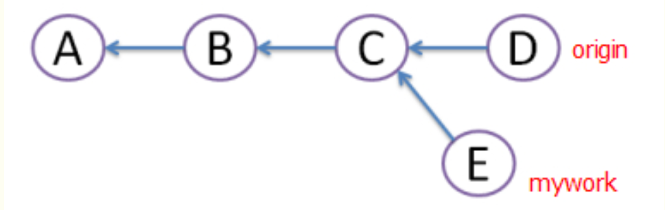
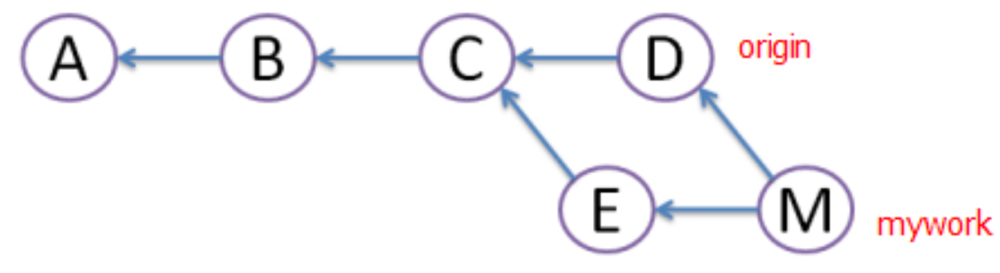
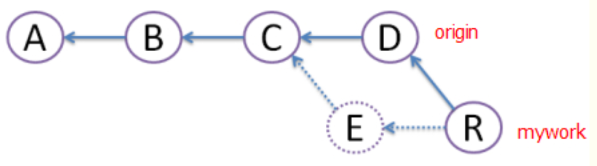
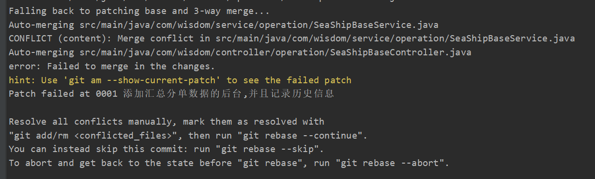
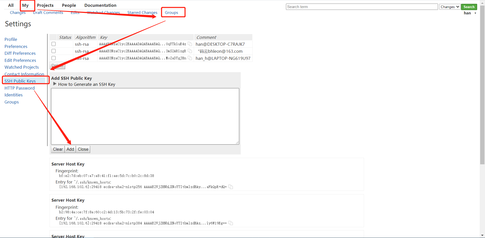

#GIT

1.git简介与工作流程
-
Git 是一个开源的分布式版本控制系统，用于敏捷高效地处理任何或小或大的项目。

Git 是 Linus Torvalds 为了帮助管理 Linux 内核开发而开发的一个开放源码的版本控制软件。

Git 与常用的版本控制工具 CVS, Subversion 等不同，它采用了分布式版本库的方式，不必服务器端软件支持。

2.基本用法
-
* 1 git clone
  
克隆项目到本地

    git clone [url]
    
[盈智科技主仓库](http://192.168.102.6/#/admin/projects/)

* 2 git status
  
查看在你上次提交之后是否有修改  
防止提交一些错误的改动,如误删,误增  

    git status

* 3 git add
  
将文件添加到缓存

    git add [文件相对路径]
    
添加所有文件  

    git add .

* 4 git commit  
  
使用 `git add` 命令将想要快照的内容写入缓存区， 而执行 `git commit` 将缓存区内容添加到本地仓库中。

如果觉得 git add 提交缓存的流程太过繁琐，Git 也允许你用 -a 选项跳过这一步。

提交格式  
    
    git commit -m '提交备注'
    
第一次提交时,git需要记录人的名字与电子邮箱,所以第一次使用时需要配置用户名和邮箱地址

    git config --global user.name 'runoob'
    git config --global user.email test@wisdom.com

* 5 git pull  

取回远程主机某个分支的更新，再与本地的分支合并

    git pull [参数] <远程主机名> <远程分支名>
    
在`git clone`时,所有本地分支默认与远程主机的同名分支，建立一种追踪关系,也可以手动建立追踪关系

    git branch --set-upstream master origin/next

如果存在这种追踪,可以忽略远程分支名,常用的命令

    git pull --rebase

* 6 git push  

将本地分支的更新，推送到远程主机。格式与`git pull`命令相似

    git push [参数] <远程主机名> <本地分支名>
    
常用命令

    git push

3.--rebase
-
`git pull` 与 `git pull --rebase` 的区别  
假设有3次提交A,B,C  

有其他人在"origin"上做了一些修改并提交了。我们创建一个名为"mywork"的分支并进行提交  

`git pull`命令把"origin"分支上的修改pull下来与本地提交合并（merge）成版本M，但这样会形成图中的菱形，让人很困惑。

`git pull --rebase`命令会创建一个新的提交R，R的文件内容和上面M的一样，但我们将E提交废除，当它不存在（图中用虚线表示）。好处是避免了菱形的产生，保持提交曲线为直线，让大家易于理解。

处理冲突时的区别:
`git pull`解决完冲突后,需要重新 git commit  
`git pull --rebase`直接执行`git rebase --continue`

4.git stash
-
保存当前工作进度，会把暂存区和工作区的改动保存起来。将工作区恢复成没有任何改动的状态

    git stash
    
恢复最进一次保存到工作区

    git stash pop

5.解决冲突
-
1.	`git add .`
2.	`git commit -m "备注"`
3.	`git pull -–rebase`: 拉取最新代码(发生冲突)
4.	 
5.	git status查看冲突文件
6.	解决冲突
手动打开发生冲突的文件,发生冲突的地方会被<<<<<<<<<<<<<<<<<<,==========================,>>>>>>>>>>>>>>>>>>>>>>>包围  
<<<<<<和=====之间是自己的代码,======和>>>>>>>之间是别人的代码
7.	`git add .`
8.	`git rebase –-continue` :告诉程序冲突已经解决
9.	新版本可以会出现一个vim模式的文本,:q退出即可
10.	`git push origin master` :提交代码(origin是远程仓库名,master是本地的分支名)

6.撤销提交
-
* 1 add撤销

    git reset HEAD <文件名>  
    
文件名不加的话就是撤销全部

* 2 commit撤销

查看节点  

    git log  
 
撤销   

    git reset commit_id
     
commit_id是log查出节点的id

* 3 如果已经提交了(push)

`git revert HEAD` 撤销前一次 commit  
`git revert HEAD^` 撤销前前一次 commit  
`git revert commit-id` (撤销指定的版本，撤销也会作为一次提交进行保存） 

7.切换分支,分支合并
-

切换分支  
查询远程分支,可以看到分支名称

    git branch -a
    
切换分支

    git checkout [分支名称]
    
注意: 切换分支前一定要保存修改(commit)

分支合并  
合并某分支到当前分支

    git merge [分支名称]
    
冲突处理,解决冲突后

    git add .
    git commit -m "备注"

跑路必备: 删除分支`git branch -d [分支名称]`

8.SSH
-

    C:\Users\han_h\.ssh

如果之前没有生成过SSH

    ssh-keygen -t rsa -C "youremail@example.com"

 

9.使用注意事项
-
每次提交一个功能

10.IDEA/WebStorm部分功能介绍
-
以后再写吧